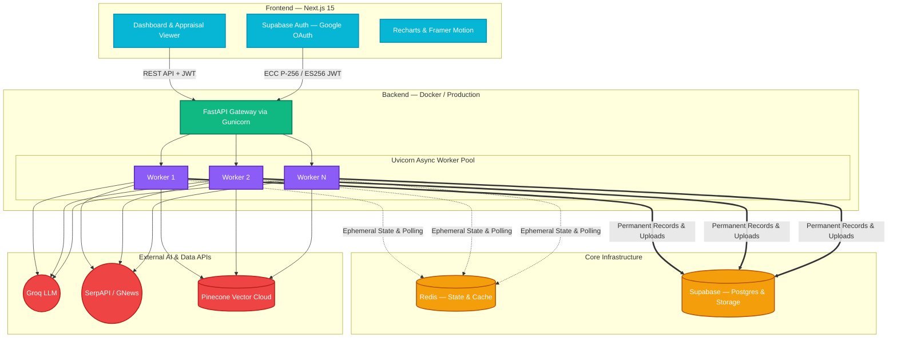
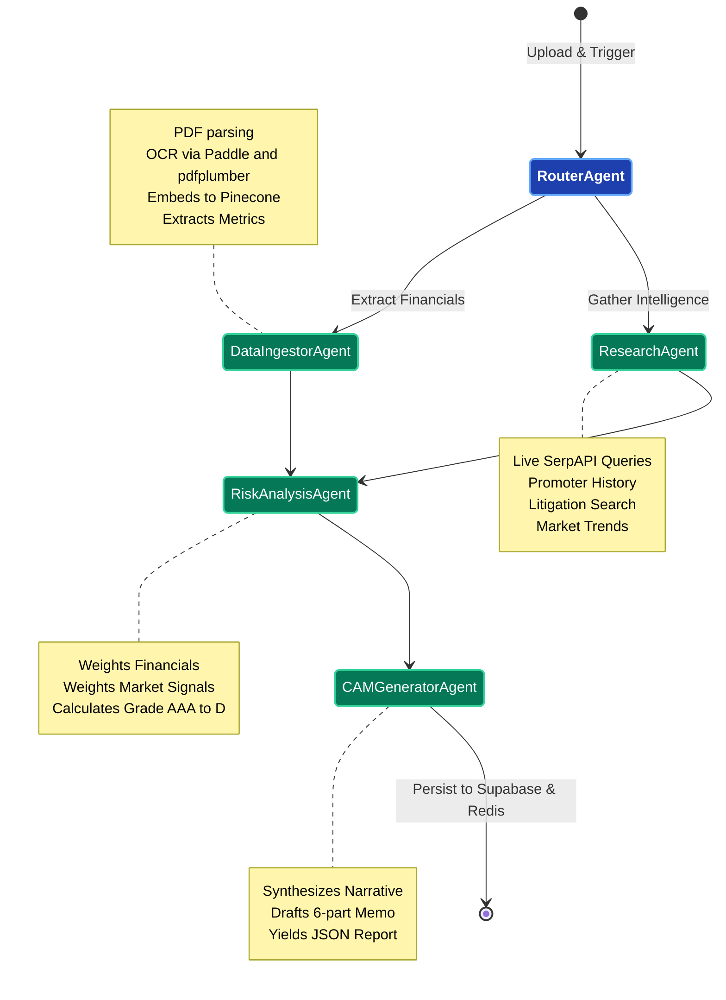
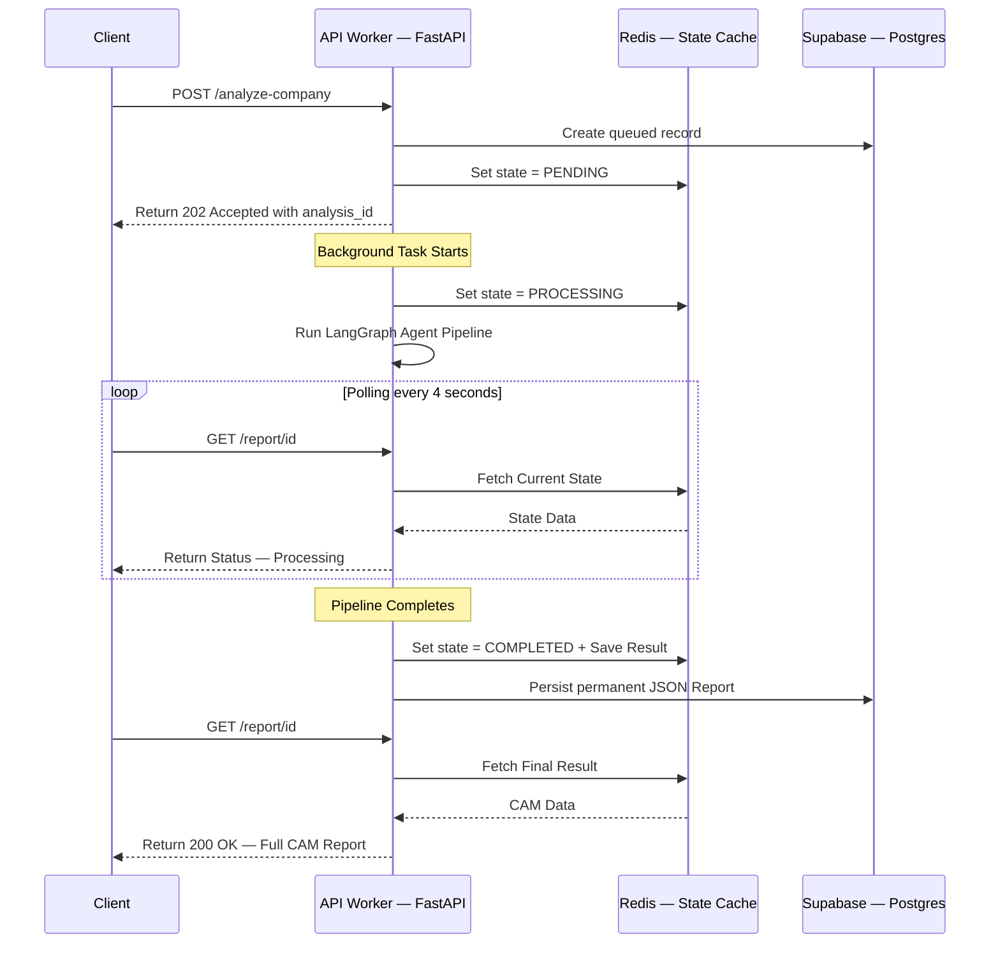

# 🏦 CredIntel AI — AI-Powered Corporate Credit Appraisal Engine

## 🚀 Transforming Corporate Lending with Autonomous Intelligence

**CredIntel AI** is a production-grade, distributed multi-agent AI system designed to automate the generation of **Credit Appraisal Memos (CAM)** for corporate loan applications. By orchestrating a sophisticated pipeline using **LangGraph**, the system autonomously ingests financial documents, performs real-time global research, extracts critical metrics, computes risk coefficients, and provides structured intelligence ready for institutional decision-making.

---

## 🏗️ Technical Architecture & Infrastructure

The system is built for a **distributed, containerized production environment**, heavily utilizing **FastAPI**, **Redis** for state management, **Supabase** for persistence, and a **Next.js** frontend for a premium intelligence dashboard.

### High-Level System Architecture



---

## 🛠️ Core Capabilities

- **Autonomous Agent Orchestration**: A sophisticated team of specialized AI agents (Router, Ingestor, Research, Risk, Generator) working in a stateful Directed Acyclic Graph (DAG) built on **LangGraph**.
- **Production-Ready Distributed State**: Uses **Redis** for in-flight state sharing across multiple Uvicorn workers, ensuring seamless background task execution and client status polling without dropped states.
- **Hybrid Extraction Engine**: Combines `pdfplumber` for digital text with `PaddleOCR` for scanned page reconstruction and spatial table detection.
- **Global Intelligence Gathering**: Real-time web research via **SerpAPI** and **GNews** for promoter due diligence, litigation signals, and sector outlooks.
- **Deterministic Risk Scoring**: A proprietary engine that combines hard banking rule-sets with LLM-driven qualitative reasoning to assign credit grades (AAA to D).
- **Vectorized Contextual Memory**: Utilizes **Pinecone Cloud** for semantic search (RAG) powered by `all-MiniLM-L6-v2` embeddings, enabling agents to find precise insights across hundreds of pages.
- **Robust Security**: Enforces **Supabase Elliptic Curve Cryptography (ECC P-256 / ES256)** JWT verification to ensure bulletproof authentication on all endpoints.
- **Premium Intelligence Dashboard**: A high-fidelity Next.js terminal UI with Glassmorphism, animated Recharts visualizations, Framer Motion transitions, and a "Deep Intelligence" dark-mode aesthetic.

---

## 🔄 The Autonomous LangGraph Pipeline

The core intelligence is driven by a multi-agent Directed Acyclic Graph (DAG).



### The Agent Lifecycle

1. **Intelligent Ingestion & Parsing**: Target documents are securely saved via `StorageService` (Local + Supabase). The **Data Ingestor Agent** chunks text and embeds it into Pinecone, while structuring raw tables into normalized `FinancialMetrics`.
2. **Global Media & Web Intelligence**: The **Research Agent** executes targeted searches to uncover promoter reputation, litigation history, and macro-economic factors.
3. **Deterministic Risk Assessment**: The **Risk Assessment Agent** aggregates metrics to compute a composite credit score (0-100) combining structural financial integrity with qualitative risk variables.
4. **CAM Synthesis**: The **CAM Generator Agent** compiles all data streams into a professional 6-section Credit Appraisal Memo (Executive Summary, Financials, Promoters, Industry, Risk, Recommendation).

---

## 💾 State Management & Persistence Strategy

The system relies on a dual-layer approach to handle complex background tasks across a distributed swarm of workers.



---

## 🎨 Frontend — Deep Intelligence Terminal

The frontend embraces a **High-Density Intelligence Terminal** aesthetic — a deep, dark-mode terminal look characterized by Obsidian surfaces, neon accents, and Glassmorphism.

### Design System

| Semantic | Token | Hex | Usage |
| :--- | :--- | :--- | :--- |
| **Base** | Deep Obsidian | `#020617` | Main terminal background |
| **Glows** | Deep Indigo | `#1E1B4B` | Radial background gradients |
| **Accent** | AI Teal | `#2DD4BF` | AI markers, inline citations, active steps |
| **Success** | Terminal Green | `#22C55E` | Grade A, Approvals, Data Validation Shields |
| **Warning** | Risk Amber | `#F59E0B` | Grade B, Processing, warning tools |
| **Danger** | Alert Red | `#EF4444` | Grade C/D, Rejections, Failed status |
| **Glass** | White Alpha | `#FFFFFF10` | Subtle 1px borders on cards for glass lift |

### Application Pages

| Route | Purpose | Key Visualizations |
| :--- | :--- | :--- |
| `/` | **Landing Experience** | Interactive Hero, Swarm Trace terminal, Trust Indicators |
| `/login` | **Authentication** | Supabase Google OAuth sign-in |
| `/dashboard` | **Intelligence Dashboard** | KPI StatCards, Credit Grade Pie, Risk Histogram, Industry Analysis, Timeline Area Chart, Appraisal Ledger |
| `/dashboard/new` | **Swarm Terminal** | Entity Identification Form, PDF Dropzone, Neural Protocol Sidebar |
| `/dashboard/report/[id]` | **Appraisal Viewer** | Semi-Donut Credit Gauge, Neural Swarm Tracker, Inline Source Citations, Risk Heatmap, Data Validation Shield |
| `/dashboard/reports` | **Reports Archive** | Historical CAM listing with status filters |

### Component Architecture

```text
Root (layout.tsx)
├── Providers (Supabase, Auth, Theme)
└── App Container
    ├── Header (Brand + Auth Actions)
    ├── Sidebar (Navigation + Recent Ingestions)
    └── Page Content
        ├── StatCard (Animated Counter + Trend Icon)
        ├── AnalyticsGrid
        │   └── RechartsContainer (Responsive wrapper)
        ├── AnalysisCard
        │   ├── Badge (Status color mapping)
        │   └── MiniProgress (Visual stage indicator)
        ├── GaugeChart (Semi-circle Risk visualization)
        ├── PipelineTracker (Animated state sequence)
        ├── IntelligenceCard (Markdown-ready content blocks)
        └── ReportPDF (React-PDF export renderer)
```

### Pipeline Status Mapping

| Backend Status | UI Step | Visualization |
| :--- | :--- | :--- |
| `parsing_documents` | Document Ingestion | OCR Engine active, layout detection |
| `extracting_financials` | Metrics Extraction | Balance sheet & P&L reconstruction |
| `researching_company` | Intelligence Gathering | Web search & sentiment analysis |
| `analyzing_risk` | Risk Computation | Scoring model executing factors |
| `generating_cam` | CAM Finalization | DOCX compilation & formatting |
| `completed` | Ready | Terminal state — report accessible |

---

## 💻 Full-Stack Tech Stack

### Backend

| Category | Technology |
| :--- | :--- |
| **Framework** | FastAPI with Gunicorn & Uvicorn workers |
| **Orchestration** | LangGraph, LangChain |
| **LLM Intelligence** | Groq Llama-3.3-70b-versatile |
| **Vector Store** | Pinecone Cloud with `all-MiniLM-L6-v2` embeddings |
| **State & Caching** | Redis (Asyncio client) |
| **Database & Storage** | Supabase (Postgres & Buckets) |
| **Web Intelligence** | SerpAPI & GNews Service |
| **OCR Engine** | PaddleOCR + pdfplumber |
| **Testing** | Pytest & Pytest-Asyncio |
| **Containerization** | Docker & Docker Compose (Multi-stage builds) |

### Frontend

| Category | Technology |
| :--- | :--- |
| **Framework** | Next.js 15 (App Router) |
| **UI Library** | React 19 |
| **Styling** | Tailwind CSS 4 (Utility-first) |
| **Components** | Shadcn/UI + Radix UI |
| **Visualizations** | Recharts (Gauge, Pie, Bar, Area, Line) |
| **Animations** | Framer Motion (Reveals, Transitions, Swarm sequences) |
| **Authentication** | Supabase Auth (Google OAuth) |
| **PDF Export** | @react-pdf/renderer |
| **Icons** | Lucide React |
| **Deployment** | Vercel |

---

## 🚀 Quick Start

### 1. Prerequisites

- Docker & Docker Compose
- Node.js 18+ & npm
- Python 3.10+
- API Keys: [Groq](https://console.groq.com), [SerpAPI](https://serpapi.com), [Pinecone](https://pinecone.io)
- Supabase Project details

### 2. Backend Configuration

Create a `.env` file in the `backend/` directory:
```env
# AI Models & Agents
GROQ_API_KEY=gsk_...
SERP_API_KEY=...
LLM_MODEL=llama-3.3-70b-versatile

# Vector Store
PINECONE_API_KEY=...
PINECONE_INDEX_NAME=credintelai
PINECONE_ENVIRONMENT=us-east-1

# Database & Auth
SUPABASE_URL=https://...
SUPABASE_KEY=eyJhb...
# Replace with actual JWT Secret from Supabase Dashboard -> API -> JWT Settings
SUPABASE_JWT_SECRET=your_jwt_secret_here

# Redis
REDIS_URL=redis://redis:6379/0

# Server
HOST=0.0.0.0
PORT=8000
WORKERS=4
CORS_ORIGINS=*
```

### 3. Frontend Configuration

Create a `.env` file in the `frontend/` directory:
```env
NEXT_PUBLIC_API_URL=http://localhost:8000
NEXT_PUBLIC_SUPABASE_URL=https://your-project.supabase.co
NEXT_PUBLIC_SUPABASE_ANON_KEY=your_anon_key
```

### 4. Deploy Full Stack (Docker — Recommended)

```bash
# 1. Start Backend + Redis
cd backend
docker compose up --build -d

# 2. Start Frontend
cd ../frontend
npm install
npm run dev
```

The application will be available at:
- **Frontend Dashboard**: `http://localhost:3000`
- **Backend API**: `http://localhost:8000`
- **Health Check**: `http://localhost:8000/health`

---

## �️ Development Setup (Local)

### Backend (Virtual Environment)

```bash
cd backend

# Setup environment
python -m venv venv
source venv/bin/activate  # Windows: venv\Scripts\activate

# Install dependencies
pip install -r requirements.txt

# Run standard Redis server (Requirement)
docker run -d --name redis -p 6379:6379 redis:7-alpine

# Set Redis URL for localhost
export REDIS_URL=redis://localhost:6379/0

# Run API (Hot Reload)
uvicorn app.main:app --reload --port 8000
```

### Frontend (Next.js Dev Server)

```bash
cd frontend

# Install dependencies
npm install

# Run development server
npm run dev
```


## 📁 Full Project Structure

```text
AIMLCREDIT/
├── README.md                         # Unified Project Documentation
├── FRONTEND_ARCHITECTURE.md          # Detailed Frontend Design Specification
│
├── backend/
│   ├── Dockerfile                    # Multi-stage production image
│   ├── docker-compose.yml            # Container orchestration (App + Redis)
│   ├── gunicorn.conf.py              # Production Web Server config
│   ├── requirements.txt              # Python dependencies
│   ├── supabase_schema.sql           # Database schema definition
│   ├── pytest.ini                    # Test configuration
│   ├── app/
│   │   ├── main.py                   # API Endpoints & Lifecycle Manager
│   │   ├── config.py                 # Pydantic Settings
│   │   ├── agents/                   # LangGraph Nodes
│   │   │   ├── scoring_engine.py     # Deterministic Risk Mathematics
│   │   │   ├── risk_agent.py         # Risk Assessment Agent
│   │   │   └── cam_generator_agent.py# CAM Generation Agent
│   │   ├── graph/
│   │   │   └── workflow.py           # LangGraph DAG Definition
│   │   ├── services/
│   │   │   ├── redis_state.py        # Centralized State Manager
│   │   │   ├── storage_service.py    # Local & Supabase Storage
│   │   │   └── document_parser.py    # Multi-pass PDF/OCR Extractor
│   │   ├── db/
│   │   │   └── supabase_repository.py# Async Postgres Operations
│   │   ├── models/
│   │   │   └── schemas.py            # Strict Contracts (Pydantic)
│   │   └── utils/
│   │       └── observability.py      # Telemetry & Time Tracking
│   └── tests/
│       ├── conftest.py               # Shared API & DB Mocks
│       ├── test_api.py               # Endpoint logic validation
│       ├── test_scoring.py           # Core mathematics coverage
│       └── test_workflow.py          # State/DAG assertions
│
└── frontend/
    ├── package.json                  # Dependencies & Scripts
    ├── next.config.ts                # Next.js Configuration
    ├── tsconfig.json                 # TypeScript Configuration
    ├── components.json               # Shadcn/UI Configuration
    ├── postcss.config.mjs            # PostCSS / Tailwind Pipeline
    ├── eslint.config.mjs             # ESLint Configuration
    ├── public/                       # Static assets
    └── src/
        ├── app/
        │   ├── layout.tsx            # Root Layout (Providers, Fonts)
        │   ├── page.tsx              # Landing Page — Hero & Swarm Trace
        │   ├── globals.css           # Global Styles & Design Tokens
        │   ├── login/
        │   │   └── page.tsx          # Authentication Page
        │   └── dashboard/
        │       ├── layout.tsx        # Dashboard Shell (Sidebar + Header)
        │       ├── page.tsx          # Intelligence Dashboard (KPIs, Charts)
        │       ├── new/
        │       │   └── page.tsx      # New Analysis — Swarm Terminal
        │       ├── report/
        │       │   └── [id]/         # Dynamic Appraisal Viewer
        │       └── reports/
        │           └── page.tsx      # Reports Archive
        ├── components/
        │   ├── Sidebar.tsx           # Navigation & Recent Analyses
        │   ├── ReportPDF.tsx         # React-PDF Export Renderer
        │   └── ui/                   # Shadcn/UI Primitives (15 components)
        └── lib/
            └── utils.ts              # Shared Utilities
```

---

## 🔐 Security Architecture

- **Authentication**: Supabase Auth with Google OAuth 2.0
- **JWT Verification**: ECC P-256 / ES256 Elliptic Curve Cryptography
- **API Protection**: All API endpoints enforce JWT verification via middleware
- **CORS**: Configurable CORS policy via `CORS_ORIGINS` environment variable
- **Storage**: Supabase Buckets with row-level security for document uploads

---

## 📊 Semantic Grade Mapping

| Grade | Classification | UI Treatment | Score Range |
| :--- | :--- | :--- | :--- |
| **AAA / AA / A** | Investment Grade | Terminal Green (`#22C55E`) | 80 — 100 |
| **BBB / BB / B** | Moderate Risk | Risk Amber (`#F59E0B`) | 50 — 79 |
| **CCC / CC / C** | Sub-Investment | Alert Red (`#EF4444`) | 25 — 49 |
| **D** | Default / Distressed | Alert Red (`#EF4444`) | 0 — 24 |

---

*Architected and Built for High-Stakes Institutional Finance.*
