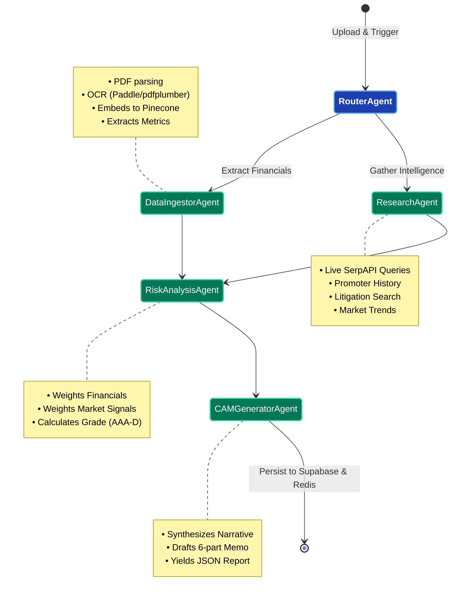
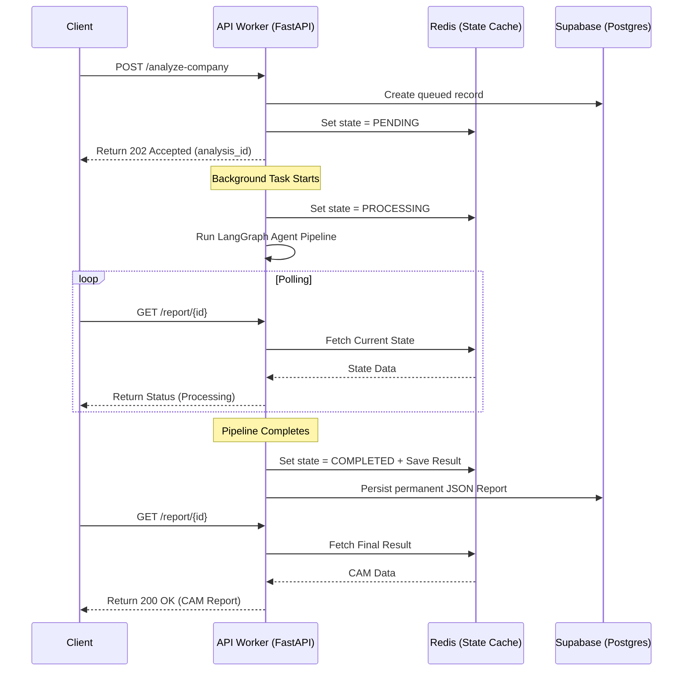

# 🏦 Intelli-Credit: AI-Powered Corporate Credit Appraisal Engine

## 🚀 Transforming Corporate Lending with Autonomous Intelligence

**Intelli-Credit** is a production-grade, distributed multi-agent AI system designed to automate the generation of **Credit Appraisal Memos (CAM)** for corporate loan applications. By orchestrating a sophisticated pipeline using **LangGraph**, the system autonomously ingests financial documents, performs real-time global research, extracts critical metrics, computes risk coefficients, and provides structured intelligence ready for institutional decision-making.

---

## 🏗️ Technical Architecture & Infrastructure

The backend is built for a **distributed, containerized production environment**, heavily utilizing **FastAPI**, **Redis** for state management, and **Supabase** for persistence.

### High-Level System Architecture

```mermaid
graph TB
    %% Styling
    classDef client fill:#3b82f6,stroke:#1e3a8a,stroke-width:2px,color:#fff;
    classDef api fill:#10b981,stroke:#047857,stroke-width:2px,color:#fff;
    classDef worker fill:#8b5cf6,stroke:#5b21b6,stroke-width:2px,color:#fff;
    classDef infra fill:#f59e0b,stroke:#b45309,stroke-width:2px,color:#fff;
    classDef external fill:#ef4444,stroke:#b91c1c,stroke-width:2px,color:#fff;

    Client[Frontend Client UI / Dashboard]:::client

    subgraph "Docker / Production Environment"
        API[FastAPI Load Balancer (Gunicorn)]:::api
        
        subgraph "Uvicorn Asynchronous Workers"
            W1[Worker Process 1]:::worker
            W2[Worker Process 2]:::worker
            W3[Worker Process N]:::worker
        end
    end

    subgraph "Core Infrastructure"
        Redis[(Redis<br>Shared State & Cache)]:::infra
        Supabase[(Supabase<br>Postgres + Storage)]:::infra
    end

    subgraph "External AI & Data APIs"
        Groq((Groq LLM)):::external
        Serp((SerpAPI / GNews)):::external
        Pinecone[(Pinecone Vector Cloud)]:::external
    end

    %% Flow
    Client -- "JWT Auth & REST API" --> API
    API --> W1 & W2 & W3
    
    W1 -. "Ephemeral State & Polling" .-> Redis
    W2 -. "Ephemeral State & Polling" .-> Redis
    W3 -. "Ephemeral State & Polling" .-> Redis
    
    W1 == "Permanent Records & Uploads" ==> Supabase
    W2 == "Permanent Records & Uploads" ==> Supabase
    W3 == "Permanent Records & Uploads" ==> Supabase

    W1 & W2 & W3 --> Groq & Serp & Pinecone
```

---

## 🛠️ Core Capabilities

- **Autonomous Agent Orchestration**: A sophisticated team of specialized AI agents (Router, Ingestor, Research, Risk, Generator) working in a stateful Directed Acyclic Graph (DAG) built on **LangGraph**.
- **Production-Ready Distributed State**: Uses **Redis** for in-flight state sharing across multiple Uvicorn workers, ensuring seamless background task execution and client status polling without dropped states.
- **Hybrid Extraction Engine**: Combines `pdfplumber` for digital text with `PaddleOCR` for scanned page reconstruction and spatial table detection.
- **Global Intelligence Gathering**: Real-time web research via **SerpAPI** and **GNews** for promoter due diligence, litigation signals, and sector outlooks.
- **Deterministic Risk Scoring**: A proprietary engine that combines hard banking rule-sets with LLM-driven qualitative reasoning to assign credit grades (AAA to D).
- **Vectorized Contextual Memory**: Utilizes **Pinecone Cloud** for semantic search (RAG) powered by `all-MiniLM-L6-v2` embeddings, enabling agents to find precise insights across hundreds of pages.
- **Robust Security**: Enforces **Supabase Elliptic Curve Cryptography (ECC P-256 / ES256)** JWT verification to ensure bulletproof authentication on all endpoints.

---

## 🔄 The Autonomous LangGraph Pipeline

The core intelligence is driven by a multi-agent Directed Acyclic Graph (DAG). 



### The Agent Lifecycle

1. **Intelligent Ingestion & Parsing**: Target documents are securely saved via `StorageService` (Local + Supabase). The **Data Ingestor Agent** chunks text and embeds it into Pinecone, while structuring raw tables into normalized `FinancialMetrics`.
2. **Global Media & Web Intelligence**: The **Research Agent** executes targeted searches to uncover promoter reputation, litigation history, and macro-economic factors.
3. **Deterministic Risk Assessment**: The **Risk Assessment Agent** aggregates metrics to compute a composite credit score (0-100) combining structural financial integrity with qualitative risk variables.
4. **CAM Synthesis**: The **CAM Generator Agent** compiles all data streams into a professional 6-section Credit Appraisal Memo (Executive Summary, Financials, Promoters, Industry, Risk, Recommendation).

---

## 💾 State Management & Persistence Strategy

The system relies on a dual-layer approach to handle complex background tasks across a distributed swarm of workers.



---

## 💻 Tech Stack

- **Framework**: FastAPI (Asynchronous API layer) with Gunicorn & Uvicorn workers
- **Orchestration**: LangGraph, LangChain
- **Intelligence**: Groq Llama-3.3-70b-versatile
- **State & Caching**: Redis (Asyncio client)
- **Database & Storage**: Supabase (Postgres & Buckets)
- **Web Data**: SerpAPI & GNews Service
- **OCR Engine**: PaddleOCR + pdfplumber
- **Testing**: Pytest & Pytest-Asyncio
- **Containerization**: Docker & Docker Compose (Multi-stage builds)

---

## 🚀 Quick Start (Production/Docker)

### 1. Prerequisites
- Docker & Docker Compose
- API Keys: [Groq](https://console.groq.com), [SerpAPI](https://serpapi.com), [Pinecone](https://pinecone.io)
- Supabase Project details

### 2. Configuration
Create a `.env` file in the `backend/` root directory:
```env
# AI Models & Agents
GROQ_API_KEY=gsk_...
SERP_API_KEY=...
LLM_MODEL=llama-3.3-70b-versatile

# Vector Store
PINECONE_API_KEY=...
PINECONE_INDEX_NAME=credintelai
PINECONE_ENVIRONMENT=us-east-1

# Database & Auth
SUPABASE_URL=https://...
SUPABASE_KEY=eyJhb...
# Replace with actual JWT Secret from Supabase Dashboard -> API -> JWT Settings
SUPABASE_JWT_SECRET=your_jwt_secret_here

# Redis
REDIS_URL=redis://redis:6379/0

# Server
HOST=0.0.0.0
PORT=8000
WORKERS=4
CORS_ORIGINS=*
```

### 3. Deploy Stack
```bash
# Build and run the Backend API and Redis container concurrently
docker compose up --build -d
```
The API is now running on `http://localhost:8000`. Check health at `http://localhost:8000/health`.

---

## 🛠️ Development Setup (Local Virtual Environment)

```bash
# Setup environment
python -m venv venv
source venv/bin/activate  # Windows: venv\Scripts\activate

# Install dependencies
pip install -r requirements.txt

# Run standard Redis server (Requirement)
docker run -d --name redis -p 6379:6379 redis:7-alpine

# Set Redis URL for localhost
export REDIS_URL=redis://localhost:6379/0

# Run API (Hot Re-load)
uvicorn app.main:app --reload --port 8000
```

---

## 🧪 Testing

The backend includes a comprehensive, mocked test suite. No infrastructure (Redis/Supabase/Groq) is needed to run unit tests.

```bash
# Run entire test suite
pytest -v

# Run specific modules
pytest tests/test_scoring.py -v
pytest tests/test_workflow.py -v
pytest tests/test_api.py -v
```

---

## 📁 Project Structure

```text
backend/
├── Dockerfile                    # Multi-stage production image
├── docker-compose.yml            # Container orchestration (App + Redis)
├── gunicorn.conf.py              # Production Web Server config
├── app/
│   ├── main.py                   # API Endpoints & Lifecycle Manager
│   ├── config.py                 # Pydantic Settings
│   ├── agents/                   # LangGraph Nodes
│   │   ├── scoring_engine.py     # Deterministic Risk Math
│   │   ├── risk_agent.py         
│   │   └── cam_generator_agent.py
│   ├── graph/
│   │   └── workflow.py           # LangGraph DAG Definition
│   ├── services/                 
│   │   ├── redis_state.py        # Centralized State Manager
│   │   ├── storage_service.py    # Local & Supabase Storage 
│   │   └── document_parser.py    # Multi-pass PDF/OCR Extractor
│   ├── db/
│   │   └── supabase_repository.py# Async Postgres Operations
│   ├── models/
│   │   └── schemas.py            # Strict Contracts (Pydantic)
│   └── utils/
│       └── observability.py      # Telemetry & Time tracking
└── tests/
    ├── conftest.py               # Shared API & DB Mocks
    ├── test_api.py               # Endpoint logic validation
    ├── test_scoring.py           # Core mathematics coverage
    └── test_workflow.py          # State/DAG assertions
```

---
*Architected and Built for High-Stakes Institutional Finance.*
